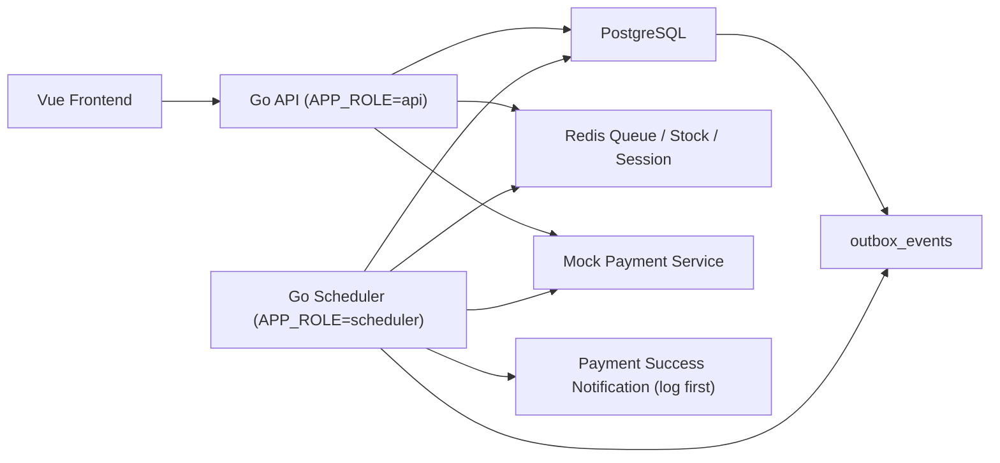
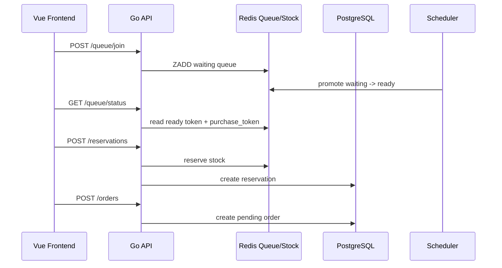
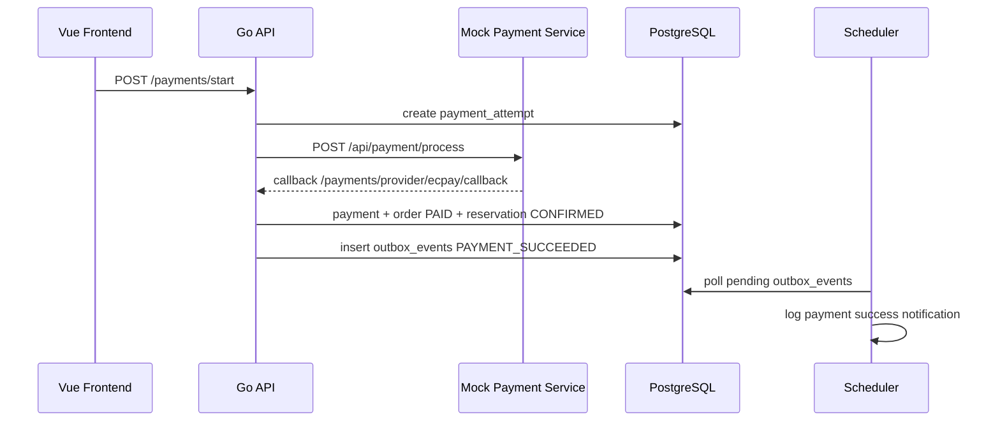
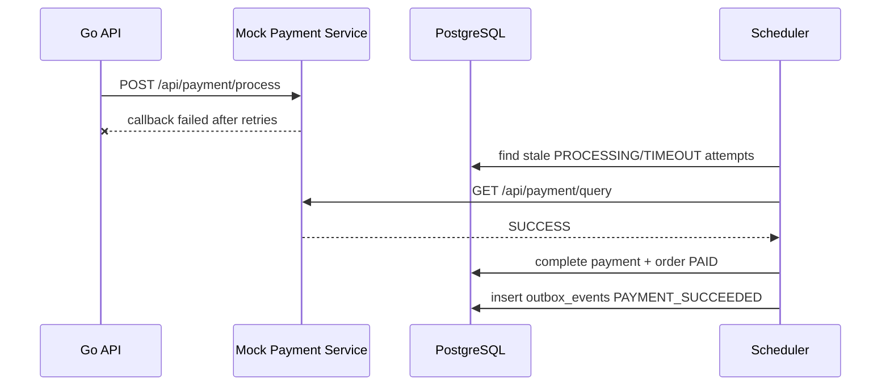

# Buy Ticket

高併發搶票系統範例。核心重點是排隊閘門、Redis 庫存、PostgreSQL 交易一致性、付款 callback、idempotency、scheduler 補償與後台管理。

目前採用 **layered monolith**（分層式單體），不是強行拆微服務。API 與 scheduler 使用同一個 binary / image，透過 `APP_ROLE` 分成不同 runtime role，方便本機開發與 K3s 部署。目前的 package 主要依 controller、service、repository 與 domain 等技術分層組織，未來可再依 booking、payment、admin 等業務邊界漸進演進為 modular monolith。

## Architecture

```text
Vue Frontend
  -> Go API
      -> PostgreSQL
      -> Redis Queue / Redis Stock
      -> Mock Payment Service
  -> Scheduler Role
      -> queue promotion
      -> order expiration
      -> payment reconciliation
      -> outbox publish
      -> stock reconciliation
```

### System Diagram



### Runtime Roles

| Role | 說明 |
| --- | --- |
| `APP_ROLE=all` | 本機/dev 預設，API + scheduler 都啟動 |
| `APP_ROLE=api` | 只啟動 HTTP API，不跑 background jobs |
| `APP_ROLE=scheduler` | 只跑 background jobs，不啟動 HTTP server |

Kubernetes 建議使用同一個 image、兩個 Deployment：

```text
buy-ticket-api        APP_ROLE=api
buy-ticket-scheduler  APP_ROLE=scheduler
```

這樣 API replicas 擴充時，不會同時啟動多份 scheduler。

## Core Features

### Queue

- 使用 Redis queue model：`waiting ZSET` + `ready ZSET`。
- `/queue/join` 只加入 waiting queue。
- scheduler 依 `queue.release.limit` 定期放行 ready token。
- ready 後產生 `purchase_token`，前端才能 reserve ticket。
- API 有 backpressure，避免瞬間大量 `/queue/join` 打爆服務。

相關文件：

- `doc/queue-design.md`

### Booking Sequence



### Inventory

- Redis 做高併發 reserve 快取。
- PostgreSQL 是 durable consistency boundary。
- 票區庫存有 `reserved_quantity` / `sold_quantity`。
- 訂單逾時會釋放 reservation 與庫存。
- `stock-reconcile` scheduler 會修復 Redis 與 DB 庫存差異。

相關文件：

- `doc/stock-reconciliation.md`

### Payment

付款主流程：

```text
POST /payments/start
-> 建立 payment_attempt
-> 後端呼叫 mock payment service
-> 等 provider callback
-> callback 成功後建立 payment、order PAID、reservation CONFIRMED
```

已包含：

- Payment attempt log。
- Payment-only idempotency。
- Provider callback idempotency。
- Circuit breaker。
- 多 provider router，但不自動重送同一筆 attempt 到另一家。
- Payment reconciliation：callback 遺失時，scheduler 主動查 provider payment status。

相關文件：

- `doc/payment-design.md`

### Payment Sequence



### Payment Reconciliation Sequence


### Outbox

付款成功後會在同一個 DB transaction 寫入 `outbox_events`：

```text
PAYMENT_SUCCEEDED
```

目前 publisher 先用 log 模擬付款成功通知，不接真 SMTP。未來可以替換成 RabbitMQ / Kafka / Notification Service。

相關文件：

- `doc/payment-design.md`

### Admin Backoffice

後台帳號與前台使用者分離。

- `SUPER_ADMIN`：最高權限，可管理 organizers、admin users、events。
- `EVENT_ADMIN`：主辦方帳號，只能看自己 organizer 的資料。

目前後台支援：

- Admin login/logout/me。
- Organizer CRUD。
- Admin user CRUD。
- Event CRUD。
- Section CRUD。
- Orders keyset pagination。
- Audit logs keyset pagination。
- Sensitive data masking / reveal audit log。
- `events`、`event_sections`、`organizers`、`admin_users` 使用 `version` 做 optimistic lock。

相關文件：

- `doc/admin-backoffice.md`

## Local Development

### Infra

啟動 PostgreSQL / Redis / RabbitMQ 等本機 infra：

```powershell
docker compose up -d
```

執行 migration：

```powershell
make migrate-up
```

啟動 Go API + scheduler：

```powershell
make run-dev
```

或指定 role：

```powershell
$env:APP_ROLE="api"
go run .
```

```powershell
$env:APP_ROLE="scheduler"
go run .
```

### Mock Payment Service

mock payment service 預設：

```text
http://localhost:8081
```

健康檢查：

```powershell
curl http://localhost:8081/health
```

## Testing

後端測試：

```powershell
go test ./...
```

Swagger 重新生成：

```powershell
swag init -g main.go -o docs
```

如果尚未安裝 `swag`：

```powershell
go install github.com/swaggo/swag/cmd/swag@latest
```

## K6 Flow

高併發壓測前，先準備固定測試使用者與 session。

註冊測試使用者：

```powershell
k6 run -e BASE_URL=http://localhost:8080 -e USER_COUNT=1000 -e REGISTER_VUS=50 tests/k6/register-users.js
```

產生 session 檔：

```powershell
$env:BASE_URL="http://localhost:8080"
$env:USER_COUNT="1000"
$env:LOGIN_CONCURRENCY="50"
go run ./cmd/k6-login-sessions
```

執行搶票 flow：

```powershell
k6 run -e BASE_URL=http://localhost:8080 -e EVENT_ID=1 -e QUANTITY=1 -e VUS=1000 -e MAX_QUEUE_POLLS=120 tests/k6/booking-flow.js
```

主要壓測流程：

```text
healthz
讀取 event / availability
使用預先登入 session
join queue
poll queue status
reserve ticket
create order
```

## Demo Flow

建議展示順序：

```text
1. 開啟 API、scheduler、Redis、PostgreSQL、mock payment service
2. 前台登入
3. 進入活動頁
4. 加入排隊
5. ready 後選票並建立 reservation
6. 確認訂單
7. POST /payments/start
8. mock payment callback 成功
9. order 變 PAID
10. reservation 變 CONFIRMED
11. outbox_events 產生 PAYMENT_SUCCEEDED
12. scheduler 發布 outbox log
```

## Deployment

Helm chart 在：

```text
charts/buy-ticket
```

本地 K3s / k3d 可使用：

```powershell
helm template buy-ticket ./charts/buy-ticket -f ./charts/buy-ticket/values-local.yaml
```

正式部署時建議：

```text
API replicas: 2+
Scheduler replicas: 1
PostgreSQL / Redis 作為外部 infra
```

## Design Notes

這個作品刻意保留單體邊界，原因是搶票核心交易需要清楚的一致性模型。微服務不是目前第一目標；目前採用：

```text
layered monolith
runtime role split
transactional outbox
scheduler compensation
Redis + PostgreSQL consistency boundary
```

這樣可以先把交易正確性與高併發行為講清楚。當業務邊界與獨立擴縮需求變得明確時，可先演進為 modular monolith，再視需要拆出 notification、reporting 或 payment service。
