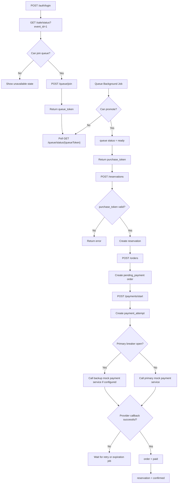
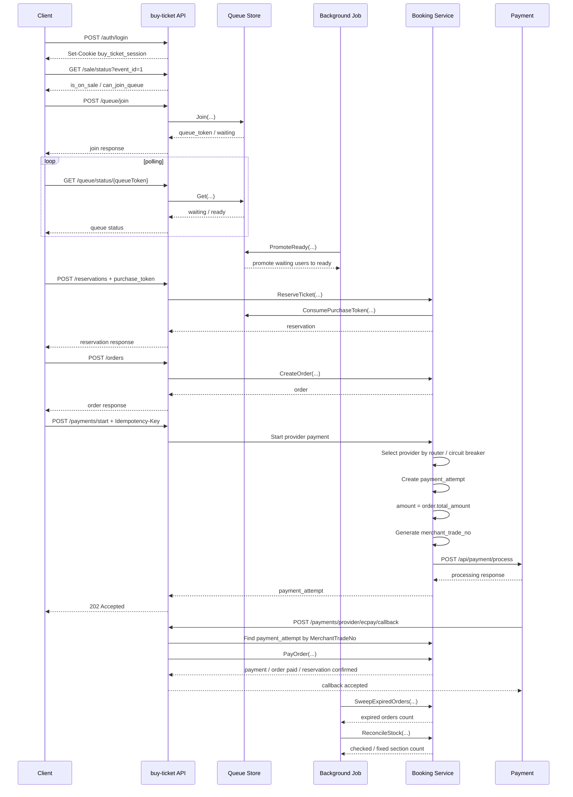

# API Flow

This document describes the current `buy-ticket` booking flow:

- auth session
- queue
- purchase token
- reservation
- order
- payment
- background jobs
- stock reconciliation

---

## 1. Main Flow

1. Register or login first.
2. Check sale status with `GET /sale/status`.
3. Join queue with `POST /queue/join`.
4. Poll queue status with `GET /queue/status/{queueToken}`.
5. Background job promotes waiting users to ready.
6. Ready queue status returns a `purchase_token`.
7. Create reservation with `POST /reservations` and the `purchase_token`.
8. Create order with `POST /orders`.
9. Start provider payment with `POST /payments/start`; frontend should send `Idempotency-Key`.
   - New payment attempts use provider router.
   - If primary payment provider breaker is open, a new attempt can use backup provider.
   - Existing timeout attempts are not resent across providers.
10. Background jobs clean up expired queues, purchase tokens, unpaid orders, and Redis stock drift.

Authenticated write APIs read the current user from the session cookie. The frontend must not send `user_id` for queue join or reservation creation.

---

## 2. Flow Diagram

---

## 3. Sequence Diagram

---

## 4. Queue Background Job

Queue promotion is controlled by a background job, not by `GET /queue/status`.

Behavior:

- Runs every 1 second.
- Calls `QueueStore.PromoteReady(...)`.
- Uses `QUEUE_RELEASE_LIMIT` to control the maximum number of users held in `ready`.

Configuration:

- Job name: `queue-promote-ready`
- Cron spec: `*/1 * * * * *`
- `QUEUE_RELEASE_LIMIT`: loaded from typed config through environment variables or local `.env`

---

## 5. Order Expiration Job

Unpaid order expiration is controlled by a background job.

Behavior:

- Runs every 5 seconds.
- Calls `BookingService.SweepExpiredOrders(...)`.
- Finds expired `pending_payment` orders.
- Marks the order as `expired`.
- Marks the reservation as `expired`.
- Releases section stock.

Configuration:

- Job name: `order-expire-sweep`
- Cron spec: `*/5 * * * * *`
- `ORDER_EXPIRE_BATCH_SIZE`: maximum number of expired orders processed per run
- `ORDER_PAYMENT_TTL_MINUTES`: server-side pending payment TTL used when creating orders

---

## 6. Stock Reconciliation Job

Redis stock reconciliation is controlled by a background job.

Inventory writes now use two layers:

- Redis Lua scripts act as the fast admission gate for reservation traffic.
- PostgreSQL section inventory updates use conditional atomic SQL updates for reserve, release, and confirm-sale transitions.

The DB update is the durable consistency boundary. If Redis succeeds but the DB transaction fails, the service compensates Redis and reconciliation can repair remaining Redis drift.

Behavior:

- Runs every 1 minute.
- Calls `BookingService.ReconcileStock(...)`.
- Loads section availability from PostgreSQL.
- Compares Redis stock with DB calculated availability.
- Fixes Redis stock when a mismatch is found.

Configuration:

- Job name: `stock-reconcile`
- Cron spec: `0 * * * * *`
- Details: see `doc/stock-reconciliation.md`

---

## 7. Background Job Summary

All jobs run when `APP_ROLE=all` or `APP_ROLE=scheduler`. Each job has a process-local no-overlap guard, but there is no distributed lock across scheduler Pods.

| Job | Cron spec | Behavior |
| --- | --- | --- |
| `queue-promote-ready` | `*/1 * * * * *` | Promotes waiting queue entries to ready |
| `order-expire-sweep` | `*/5 * * * * *` | Expires unpaid orders and releases reservations and stock |
| `event-status-advance` | `*/5 * * * * *` | Advances published events to on-sale or ended |
| `purchase-token-cleanup` | `*/1 * * * * *` | Removes expired purchase tokens from the ready queue |
| `queue-timeout-cleanup` | `*/10 * * * * *` | Removes expired waiting and ready queue entries |
| `stock-reconcile` | `0 * * * * *` | Reconciles Redis stock with PostgreSQL |
| `payment-attempt-reconcile` | `*/30 * * * * *` | Queries provider state when callbacks are missing; can be disabled |
| `outbox-publish` | `*/10 * * * * *` | Publishes pending outbox events to the current log-based publisher; can be disabled |

`payment-attempt-reconcile` and `outbox-publish` are enabled by default and can be disabled with `PAYMENT_RECONCILE_ENABLED=false` and `OUTBOX_PUBLISH_ENABLED=false`.

---

## 8. Queue Status

Queue status is returned by the API as a string:

- `WAITING`
- `READY`
- `EXPIRED`

The domain and Redis snapshot use an internal numeric enum, but clients should only depend on the API string values.

---

## 9. Key APIs

Public APIs:

- `POST /auth/register`
- `POST /auth/login`
- `GET /sale/status`
- `GET /queue/status/{queueToken}`
- `GET /events`
- `GET /events/{eventId}`
- `GET /events/{eventId}/sections`
- `GET /events/{eventId}/availability`
- `POST /payments/provider/ecpay/callback`

Authenticated APIs:

- `POST /auth/logout`
- `GET /me`
- `GET /me/reservations`
- `GET /me/orders`
- `GET /me/payments`
- `POST /queue/join`
- `POST /reservations`
- `POST /orders`
- `POST /payments`
- `POST /payments/start`
- `POST /reservations/expire`
- `POST /reservations/cancel`

---

## 10. Remaining Work

- Payment callback / webhook hardening
- Distributed scheduler locking or leader election before running multiple scheduler replicas
- Outbox claim/locking before multiple workers publish concurrently
- Real RabbitMQ integration and consumer idempotency
- RabbitMQ delay or DLQ timeout flow

---

## 11. Payment API Modes

The project currently keeps two payment entry points:

- `POST /payments`: demo direct-pay flow. It directly creates a paid payment, marks the order paid, and confirms the reservation.
- `POST /payments/start`: provider-style flow. It creates a `payment_attempt` and returns `202 Accepted`; it does not mark the order paid.

This keeps the current demo flow working while adding the provider payment foundation.

Provider router behavior:

- `mock_ecpay_primary` uses `PAYMENT_MOCK_BASE_URL`.
- `mock_ecpay_backup` uses `PAYMENT_MOCK_BACKUP_BASE_URL`.
- If primary circuit breaker is open, only a new `payment_attempt` may use backup.
- Existing timeout attempts are kept as historical records and are not automatically resent.

Circuit breaker defaults:

- `PAYMENT_BREAKER_ENABLED=true`
- `PAYMENT_BREAKER_CONSECUTIVE_FAILURES=5`
- `PAYMENT_BREAKER_OPEN_TIMEOUT_SECONDS=30`
- `PAYMENT_BREAKER_HALF_OPEN_MAX_REQUESTS=1`
