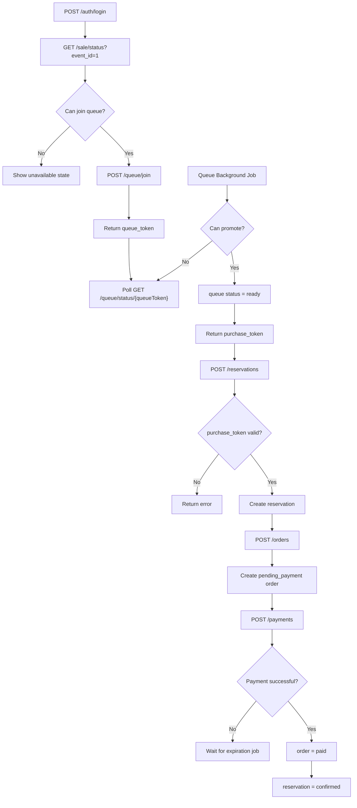
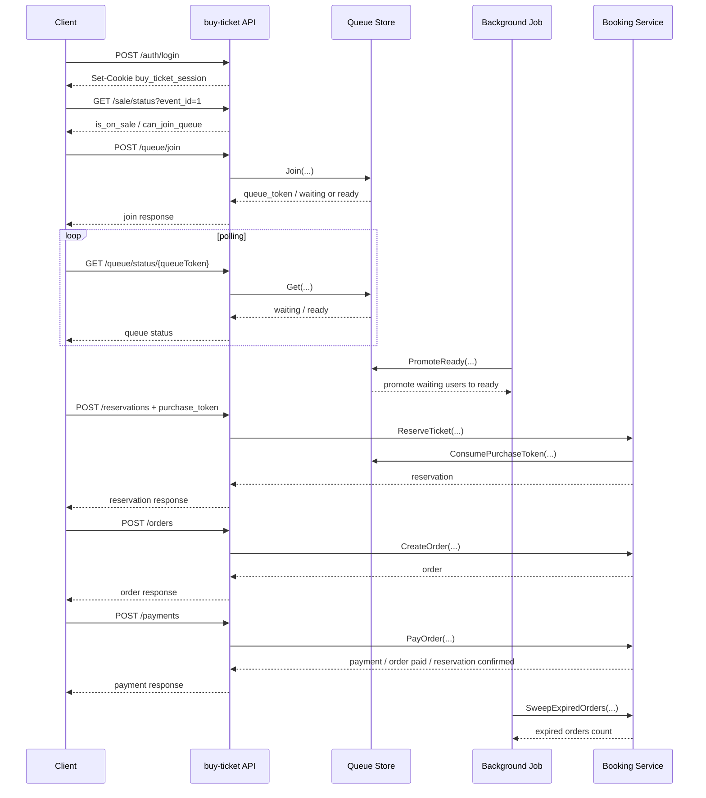

# API Flow

This document describes the current `buy-ticket` booking flow:

- auth session
- queue
- purchase token
- reservation
- order
- payment
- background jobs

---

## 1. Main Flow

1. Register or login first.
2. Check sale status with `GET /sale/status`.
3. Join queue with `POST /queue/join`.
4. Poll queue status with `GET /queue/status/{queueToken}`.
5. Background job promotes waiting users to ready.
6. Ready queue status returns a `purchase_token`.
7. Create reservation with `POST /reservations` and the `purchase_token`.
8. Create order with `POST /orders`.
9. Pay order with `POST /payments`.
10. Background jobs clean up expired queues, purchase tokens, and unpaid orders.

Authenticated write APIs read the current user from the session cookie. The frontend must not send `user_id` for queue join or reservation creation.

---

## 2. Flow Diagram

---

## 3. Sequence Diagram

---

## 4. Queue Background Job

Queue promotion is controlled by a background job, not by `GET /queue/status`.

Behavior:

- Runs every 1 second.
- Calls `QueueStore.PromoteReady(...)`.
- Uses `queue.release.limit` to control how many users can enter `ready` each run.

Configuration:

- Job name: `queue-promote-ready`
- Cron spec: `*/1 * * * * *`
- `queue.release.limit`: loaded from properties

---

## 5. Order Expiration Job

Unpaid order expiration is controlled by a background job.

Behavior:

- Runs every 5 seconds.
- Calls `BookingService.SweepExpiredOrders(...)`.
- Finds expired `pending_payment` orders.
- Marks the order as `expired`.
- Marks the reservation as `expired`.
- Releases section stock.

Configuration:

- Job name: `order-expire-sweep`
- Cron spec: `*/5 * * * * *`
- `order.expire.batch.size`: loaded from properties

---

## 6. Queue Status

Queue status uses an integer enum:

- `1` = waiting
- `2` = ready
- `3` = expired

---

## 7. Key APIs

Public APIs:

- `POST /auth/register`
- `POST /auth/login`
- `GET /sale/status`
- `GET /queue/status/{queueToken}`
- `GET /events`
- `GET /events/{eventId}`
- `GET /events/{eventId}/sections`
- `GET /events/{eventId}/availability`
- `POST /payments/provider/ecpay/callback`

Authenticated APIs:

- `POST /auth/logout`
- `GET /me`
- `GET /me/reservations`
- `GET /me/orders`
- `GET /me/payments`
- `POST /queue/join`
- `POST /reservations`
- `POST /orders`
- `POST /payments`
- `POST /reservations/expire`
- `POST /reservations/cancel`

---

## 8. Remaining Work

- Queue timeout cleanup
- Purchase token cleanup
- Redis and Lua based stock protection
- Payment callback / webhook hardening
- RabbitMQ delay or DLQ timeout flow