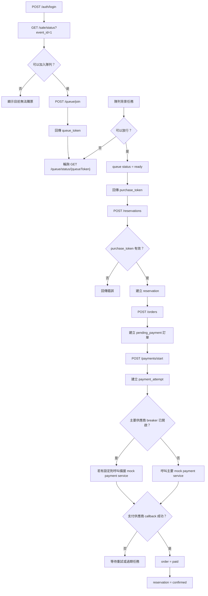
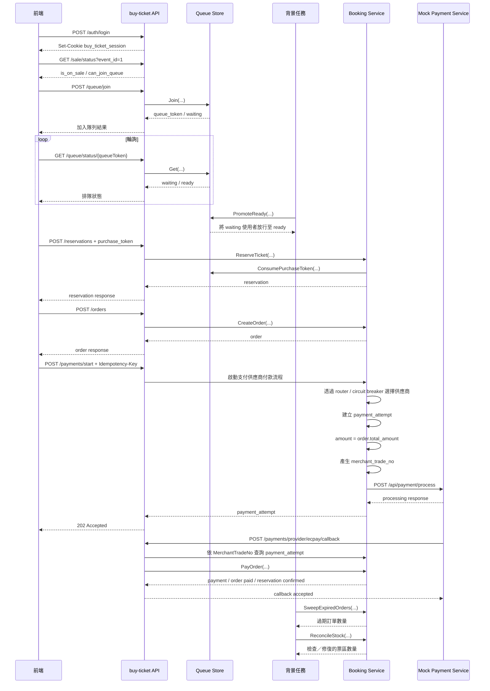

# API 流程

本文說明目前 `buy-ticket` 的搶票流程：

- 登入 Session
- 排隊機制
- 購票權杖（purchase token）
- 票券預留（reservation）
- 訂單
- 付款
- 背景任務
- 庫存對帳

---

## 1. 主要流程

1. 先註冊或登入。
2. 使用 `GET /sale/status` 查詢售票狀態。
3. 使用 `POST /queue/join` 加入隊列。
4. 使用 `GET /queue/status/{queueToken}` 輪詢排隊狀態。
5. 背景任務將等待中的使用者放行至 ready。
6. ready 狀態會回傳 `purchase_token`。
7. 使用 `purchase_token` 呼叫 `POST /reservations` 建立票券預留。
8. 使用 `POST /orders` 建立訂單。
9. 使用 `POST /payments/start` 啟動支付供應商付款流程；前端應傳送 `Idempotency-Key`。
   - 新的 payment attempt 會透過 provider router 選擇支付供應商。
   - 主要支付供應商的 circuit breaker 開啟時，新 attempt 可改用備援供應商。
   - 既有的 timeout attempt 不會跨供應商重新送出。
10. 背景任務會清理過期隊列、purchase token、未付款訂單，並修復 Redis 庫存差異。

需要驗證身分的寫入 API 會從 Session Cookie 取得目前使用者。前端在加入隊列或建立 reservation 時，不可自行傳送 `user_id`。

---

## 2. 流程圖

---

## 3. 時序圖

---

## 4. 隊列放行背景任務

隊列放行由背景任務控制，不是由 `GET /queue/status` 觸發。

行為：

- 每 1 秒執行一次。
- 呼叫 `QueueStore.PromoteReady(...)`。
- 使用 `QUEUE_RELEASE_LIMIT` 控制 ready 隊列可容納的使用者上限。

設定：

- 任務名稱：`queue-promote-ready`
- Cron：`*/1 * * * * *`
- `QUEUE_RELEASE_LIMIT`：透過環境變數或本機 `.env` 載入 typed config

---

## 5. 訂單過期背景任務

未付款訂單的過期處理由背景任務控制。

行為：

- 每 5 秒執行一次。
- 呼叫 `BookingService.SweepExpiredOrders(...)`。
- 找出已過期的 `pending_payment` 訂單。
- 將訂單標記為 `expired`。
- 將 reservation 標記為 `expired`。
- 釋放票區庫存。

設定：

- 任務名稱：`order-expire-sweep`
- Cron：`*/5 * * * * *`
- `ORDER_EXPIRE_BATCH_SIZE`：每次最多處理的過期訂單數量
- `ORDER_PAYMENT_TTL_MINUTES`：建立訂單時由伺服器設定的待付款期限

---

## 6. 庫存對帳背景任務

Redis 庫存對帳由背景任務控制。

目前庫存寫入分成兩層：

- Redis Lua script 作為 reservation 流量的快速准入閘門。
- PostgreSQL 票區庫存使用條件式原子 SQL，處理預留、釋放與確認售出的狀態轉換。

DB 是持久化的一致性邊界。如果 Redis 扣除成功但 DB transaction 失敗，service 會補償 Redis；庫存對帳則會修復剩餘的 Redis 差異。

行為：

- 每 1 分鐘執行一次。
- 呼叫 `BookingService.ReconcileStock(...)`。
- 從 PostgreSQL 載入票區可售數量。
- 比較 Redis 庫存與 DB 計算出的可售數量。
- 發現差異時修正 Redis 庫存。

設定：

- 任務名稱：`stock-reconcile`
- Cron：`0 * * * * *`
- 詳細說明：參考 `doc/stock-reconciliation.md`

---

## 7. 背景任務總覽

所有任務會在 `APP_ROLE=all` 或 `APP_ROLE=scheduler` 時執行。每個任務都有 process-local 的防重疊執行機制，但 scheduler Pod 之間目前沒有 distributed lock。

| 任務 | Cron | 行為 |
| --- | --- | --- |
| `queue-promote-ready` | `*/1 * * * * *` | 將 waiting 隊列中的使用者放行至 ready |
| `order-expire-sweep` | `*/5 * * * * *` | 將未付款訂單設為過期，並釋放 reservation 與庫存 |
| `event-status-advance` | `*/5 * * * * *` | 將已發布活動推進至售票中或已結束 |
| `purchase-token-cleanup` | `*/1 * * * * *` | 從 ready 隊列移除過期的 purchase token |
| `queue-timeout-cleanup` | `*/10 * * * * *` | 移除過期的 waiting 與 ready 隊列資料 |
| `stock-reconcile` | `0 * * * * *` | 對帳 Redis 與 PostgreSQL 庫存 |
| `payment-attempt-reconcile` | `*/30 * * * * *` | Callback 遺失時，以有限 worker pool（預設 5）主動查詢供應商狀態；可停用 |
| `outbox-publish` | `*/10 * * * * *` | 將 pending outbox event 發布至目前以 log 模擬的 publisher；可停用 |

`payment-attempt-reconcile` 與 `outbox-publish` 預設啟用，可分別設定 `PAYMENT_RECONCILE_ENABLED=false` 與 `OUTBOX_PUBLISH_ENABLED=false` 停用。

---

## 8. 排隊狀態

API 以字串回傳排隊狀態：

- `WAITING`
- `READY`
- `EXPIRED`

Domain 與 Redis snapshot 內部使用數字 enum，但 client 只應依賴 API 回傳的字串值。

---

## 9. 主要 API

公開 API：

- `POST /auth/register`
- `POST /auth/login`
- `GET /sale/status`
- `GET /queue/status/{queueToken}`
- `GET /events`
- `GET /events/{eventId}`
- `GET /events/{eventId}/sections`
- `GET /events/{eventId}/availability`
- `POST /payments/provider/ecpay/callback`

需要登入的 API：

- `POST /auth/logout`
- `GET /me`
- `GET /me/reservations`
- `GET /me/orders`
- `GET /me/payments`
- `POST /queue/join`
- `POST /reservations`
- `POST /orders`
- `POST /payments`
- `POST /payments/start`
- `POST /reservations/expire`
- `POST /reservations/cancel`

---

## 10. 待改進項目

- 強化 payment callback／webhook 安全性
- 在執行多個 scheduler replica 前加入 distributed lock 或 leader election
- 在多個 worker 併發發布前，為 Outbox 加入 claim／locking 機制
- 串接真正的 RabbitMQ，並處理 consumer idempotency
- 使用 RabbitMQ delay 或 DLQ 處理逾時流程

---

## 11. 付款 API 模式

目前專案保留兩個付款入口：

- `POST /payments`：Demo direct-pay 流程。直接建立已付款的 payment、將訂單標記為已付款，並確認 reservation。
- `POST /payments/start`：支付供應商模式。建立 `payment_attempt` 並回傳 `202 Accepted`，此時不會將訂單標記為已付款。

這樣可以在加入支付供應商基礎流程的同時，保留既有 Demo 流程。

Provider router 行為：

- `mock_ecpay_primary` 使用 `PAYMENT_MOCK_BASE_URL`。
- `mock_ecpay_backup` 使用 `PAYMENT_MOCK_BACKUP_BASE_URL`。
- 主要供應商的 circuit breaker 開啟時，只有新的 `payment_attempt` 可以改用備援供應商。
- 既有 timeout attempt 會保留為歷史紀錄，不會自動重新送出。

Circuit breaker 預設設定：

- `PAYMENT_BREAKER_ENABLED=true`
- `PAYMENT_BREAKER_CONSECUTIVE_FAILURES=5`
- `PAYMENT_BREAKER_OPEN_TIMEOUT_SECONDS=30`
- `PAYMENT_BREAKER_HALF_OPEN_MAX_REQUESTS=1`
